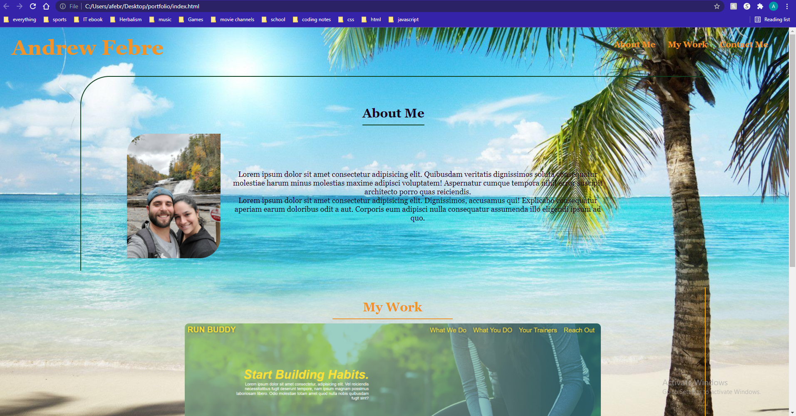

# My Portfolio

Created my portfolio, with information about me, the work I have completed, and ways to contact me.

## Criteria Met

* Presented with the developer's name, a recent photo or avatar, and links to sections about them, their work, and how to contact them.
* UI scrolls to the corresponding section.
* Scrolls to a section with titled images of the developer's applications.
* First application's image should be larger in size than the others.
* Deployable applications.
* Live URl
* Loads with no errors
* Resembles mock-up

## URL links and image of site

[URL link](https://afebre1027.github.io/portfolio/)